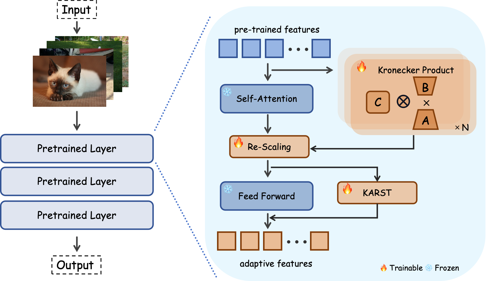

# KARST
[ICASSP 2025] KARST: Multi-Kernel Kronecker Adaptation with Re-Scaling Transmission for Visual Classification

*Pytorch implementation for ICASSP 2025 paper of [**"KARST: Multi-Kernel Kronecker Adaptation with Re-Scaling Transmission for Visual Classification"**](https://arxiv.org/abs/2502.06779)*

## Introduction

we introduce an innovative Multi-Kernel Kronecker Adaptation with Re-Scaling Transmission (KARST) for various recognition tasks. Specifically, its multi-kernel design extends Kronecker projections horizontally and separates adaptation matrices into multiple complementary spaces, reducing parameter dependency and creating more compact subspaces. Besides, it incorporates extra learnable re-scaling factors to better align with pre-trained feature distributions, allowing for more flexible and balanced feature aggregation.

**The framework and application of KARST:**



## Environment

- Python 3.11.9
- torch 2.3.0
- timm 0.9.16
- avalanche-lib 0.5.0

## Data Preparation

### 1.Visual Task Adaptation Benchmark (VTAB)

Please refer to [SSF](https://github.com/dongzelian/SSF) or [VPT](https://github.com/KMnP/vpt/blob/main/VTAB_SETUP.md) for preparing the 19 datasets included in VTAB-1K.

### 2.Few-Shot Classification

We follow [NOAH](https://github.com/ZhangYuanhan-AI/NOAH) to conduct the few-shot evaluation. There are two parts you shold pay attention to:
- Images
  
  For improved organization and indexing, images from five datasets (`fgvc-aircraft, food101, oxford-flowers102, oxford-pets, standford-cars`) should be consolidated into a folder named **FGFS**.
- Train/Val/Test splits
  
   The content, copied from the `data/few-shot` directory in [NOAH](https://github.com/ZhangYuanhan-AI/NOAH/tree/main/data/few-shot), should be placed in the FGFS folder and renamed as `few-shot_split` for path correction.

The file structure should look like:
  ```bash
  FGFS
  ├── few-shot_split
  │   ├── fgvc-aircraft
  │   │   └── annotations
  │   │       ├── train_meta.list.num_shot_1.seed_0
  │   │       └── ...
  │   │    ...
  │   └── food101
  │       └── annotations
  │           ├── train_meta.list.num_shot_1.seed_0
  │           └── ...
  ├── fgvc-aircraft
  │   ├── img1.jpeg
  │   ├── img2.jpeg
  │   └── ...
  │   ...
  └── food101
      ├── img1.jpeg
      ├── img2.jpeg
      └── ...
  ```
## Usage

### Pre-trained Models

- The pre-trained weights of ViT-B/16 is stored at this [link](https://storage.googleapis.com/vit_models/imagenet21k/ViT-B_16.npz).
- For Swin-B, the pre-trained weights will be automatically download to cache directory when you run training scripts.

### Citation
If this project is helpful for you, you can cite our paper

### Acknowledgement
The code is built upon [SSF](https://github.com/dongzelian/SSF), [NOAH](https://github.com/ZhangYuanhan-AI/NOAH), [DTL](https://github.com/heekhero/DTL/tree/main), [FacT](https://github.com/JieShibo/PETL-ViT) and [timm](https://github.com/rwightman/pytorch-image-models). 
